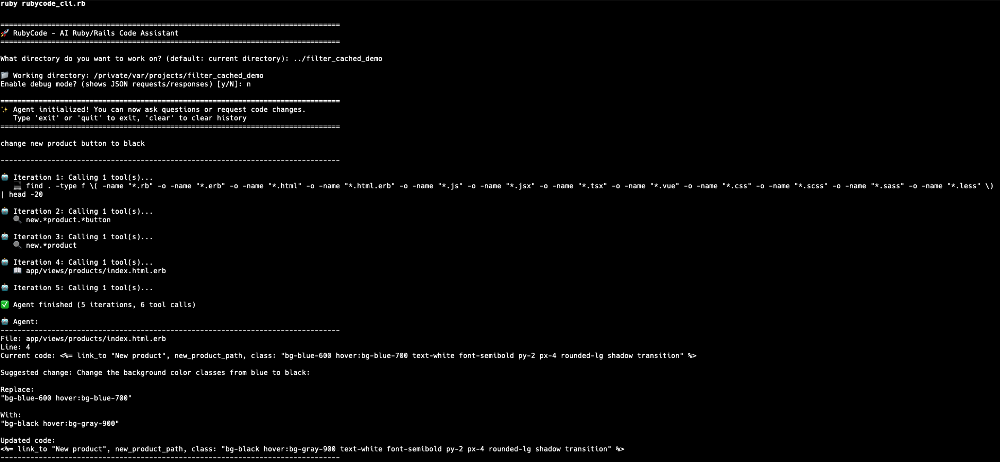

# RubyCode

[](https://badge.fury.io/rb/rubycode)
[](https://github.com/jonasmedeiros/rubycode)

A Ruby-native AI coding assistant with pluggable LLM adapters. RubyCode provides an agent-based system that can explore codebases, search files, execute commands, and assist with coding tasks.

**GitHub Repository**: [github.com/jonasmedeiros/rubycode](https://github.com/jonasmedeiros/rubycode)

## Demo



*RubyCode autonomously exploring a Rails codebase, finding the right file, and suggesting code changes.*

## Features

- **AI Agent Loop**: Autonomous task execution with tool calling
- **Multiple Cloud LLM Adapters**: Support for Ollama Cloud, DeepSeek, Gemini, OpenAI, and OpenRouter
- **Interactive Setup Wizard**: First-time configuration with provider selection and API key management
- **Plan Mode**: Interactive planning workflow with autonomous codebase exploration
  - Enter with `plan mode` command
  - AI explores codebase and presents findings
  - User approves plan before implementation
  - Auto-approve enabled during implementation
- **Built-in Tools**:
  - `bash`: Execute safe bash commands for filesystem exploration
  - `search`: Search file contents using grep with regex support
  - `read`: Read files and directories with line numbers
  - `write`: Create new files with user approval
  - `update`: Edit existing files with user approval
  - `explore`: Autonomous codebase exploration agent (read-only)
  - `web_search`: Search the internet with automatic provider fallback (DuckDuckGo/Brave/Exa)
  - `fetch`: Fetch content from URLs
  - `done`: Signal task completion with final answer
- **Persistent Memory**: SQLite-backed conversation history with Sequel ORM
- **Encrypted API Key Storage**: Secure database storage with AES-256-GCM encryption
- **Configuration Persistence**: Automatic saving and loading of preferences
- **Enhanced CLI**: TTY-based interface with formatted output, progress indicators, and approval workflows
- **Resilient Network**: Automatic retry with exponential backoff and rate limit handling
- **Debug Mode**: Comprehensive request/response logging for adapters and search providers
- **I18n Support**: Internationalized error messages and UI text

## Requirements

- Ruby 3.1 or higher

## Installation

Install the gem by executing:

```bash
gem install rubycode
```

Or add it to your application's Gemfile:

```ruby
gem "rubycode"
```

Then execute:

```bash
bundle install
```

## Quick Start

### Interactive CLI

After installing the gem, run the interactive client:

```bash
rubycode_client
```

The first time you run it, an interactive setup wizard will guide you through:
1. Selecting your LLM provider (Ollama Cloud, DeepSeek, Gemini, OpenAI, or OpenRouter)
2. Choosing a model
3. Entering API keys (saved securely with encryption)

Your configuration is automatically saved and reloaded on subsequent runs.

#### CLI Commands

Once running, you have access to these special commands:

- `plan mode` or `plan` - Enter plan mode for guided exploration and implementation
- `auto-approve on` - Enable auto-approval for write operations
- `auto-approve off` - Disable auto-approval
- `auto-approve status` - Check auto-approval status
- `config` - View/reconfigure settings
- `clear` - Clear conversation history
- `exit` or `quit` - Exit the CLI

#### Using Plan Mode

Plan mode provides a structured workflow for complex tasks:

1. Type `plan mode` to enter
2. Describe what you want to explore/implement (e.g., "add user authentication")
3. AI autonomously explores the codebase using the explore tool
4. Review the exploration findings and plan
5. Accept or reject the plan
6. If accepted, describe the implementation and AI proceeds with auto-approve enabled

Example session:
```
You: plan mode
📋 Entering Plan Mode
Next: Describe what you want to explore and implement.

You: add JWT authentication to the API

🔍 Exploring codebase...
[AI explores and presents findings]

Do you accept this plan? (Y/n) y

✓ Plan accepted. Auto-approve enabled for implementation.

Describe what you want to implement: add JWT token generation to User model

[AI implements changes without requiring approval for each file]
```

### Programmatic Usage

You can also use RubyCode in your Ruby projects:

```ruby
require "rubycode"

# Configure the LLM adapter
RubyCode.configure do |config|
  config.adapter = :ollama
  config.url = "https://api.ollama.com"
  config.model = "qwen3-coder:480b-cloud"
  config.root_path = Dir.pwd
end

# Create a client and ask a question
client = RubyCode::Client.new
response = client.ask(prompt: "Find the User model in the codebase")
puts response
```

## Usage

### Basic Usage

#### Programmatic Usage

```ruby
require "rubycode"

# Configure the LLM adapter
RubyCode.configure do |config|
  config.adapter = :ollama
  config.url = "https://api.ollama.com"
  config.model = "qwen3-coder:480b-cloud"
  config.root_path = Dir.pwd
end

# Create a client and ask a question
client = RubyCode::Client.new
response = client.ask(prompt: "Find the User model in the codebase")
puts response
```

### Configuration Options

```ruby
RubyCode.configure do |config|
  # LLM Provider Settings
  config.adapter = :ollama                    # :ollama, :deepseek, :gemini, :openai, :openrouter
  config.url = "https://api.ollama.com"       # Provider API URL
  config.model = "qwen3-coder:480b-cloud"     # Model name
  config.root_path = Dir.pwd                  # Project root directory

  # HTTP timeout and retry settings
  config.http_read_timeout = 120              # Request timeout in seconds (default: 120)
  config.http_open_timeout = 10               # Connection timeout in seconds (default: 10)
  config.max_retries = 3                      # Number of retry attempts (default: 3)
  config.retry_base_delay = 2.0               # Exponential backoff base delay (default: 2.0)
end
```

### Supported LLM Providers

| Provider | Models | API Key Required | Notes |
|----------|--------|------------------|-------|
| **Ollama Cloud** | qwen3-coder, deepseek-v3.1, gpt-oss | Yes | Cloud-hosted Ollama models |
| **DeepSeek** | deepseek-chat, deepseek-reasoner | Yes | Fast reasoning models |
| **Google Gemini** | gemini-2.5-flash, gemini-2.5-pro, gemini-3-flash-preview | Yes | Multimodal support |
| **OpenAI** | gpt-4o, gpt-4o-mini, o1 | Yes | GPT models with reasoning |
| **OpenRouter** | claude-sonnet-4.5, claude-opus-4.6, gpt-4o | Yes | Access to multiple providers |

### Available Tools

The agent has access to several built-in tools:

1. **bash**: Execute safe bash commands including:
   - Directory exploration: `ls`, `pwd`, `find`, `tree`
   - File inspection: `cat`, `head`, `tail`, `wc`, `file`
   - Content search: `grep`, `rg` (ripgrep)
   - Examples: `grep -rn "button" app/views`, `find . -name "*.rb"`
2. **search**: Simplified search wrapper (use bash + grep for more control)
3. **read**: Read files with line numbers or list directory contents
4. **write**: Create new files (requires user approval)
5. **update**: Edit existing files with exact string replacement (requires user approval)
6. **explore**: Autonomous codebase exploration agent (read-only):
   - Spawns sub-agent with constrained tools (bash, read, search, web_search, fetch, done)
   - Configurable max iterations (default: 10, max: 15)
   - Returns structured findings with summary, key files, and code flow
   - Used automatically in plan mode
7. **web_search**: Search the internet with automatic provider fallback (requires user approval):
   - Primary: Exa.ai (AI-native search, optional with API key)
   - Fallback 1: DuckDuckGo Instant Answer API (free, no API key)
   - Fallback 2: Brave Search API (optional, for better results)
8. **fetch**: Fetch and extract text content from URLs (requires user approval)
9. **done**: Signal completion and provide the final answer

**Note**: Tool schemas are externalized in `config/tools/*.json` for easy customization.

#### Web Search Configuration

**By default** (no setup needed):
- Uses DuckDuckGo Instant Answer API (free, no CAPTCHA)
- Good for factual queries and summaries

**For AI-native search** (optional, recommended):
```bash
# Sign up at https://exa.ai/api
export EXA_API_KEY=your_api_key_here
```

**For better web results** (optional):
```bash
# Sign up at https://brave.com/search/api/
export BRAVE_API_KEY=your_api_key_here
```

### New in 0.1.6

- **Plan Mode**: Interactive planning workflow with autonomous codebase exploration
  - Enter with `plan mode` or `plan` command
  - AI explores and presents findings for user approval
  - Auto-approve enabled for implementation after plan acceptance
- **Auto-Approve Commands**: Manual control over write operation approvals
  - `auto-approve on/off/status` for toggling and checking approval mode
- **Explore Tool**: Autonomous read-only codebase exploration agent
  - Constrained sub-agent with dedicated exploration prompt
  - Structured output with summary, key files, and code flow
  - Configurable iteration limits (10 default, 15 max)

### New in 0.1.5

- **CLI Executable**: `rubycode_client` command for interactive chat after gem installation
- **Improved Documentation**: Reorganized Quick Start section with CLI-first approach

### New in 0.1.4

- **Bug Fix**: Agent now properly stops when `done` tool is called, even if tool execution fails
- **Multiple Cloud LLM Adapters**: Support for 5 providers (Ollama Cloud, DeepSeek, Gemini, OpenAI, OpenRouter)
- **Web Search & Fetch Tools**: Internet search with automatic fallback (Exa/DuckDuckGo/Brave)
- **Interactive Setup Wizard**: First-time configuration with guided setup
- **Encrypted API Key Storage**: Secure database storage with AES-256-GCM
- **Configuration Persistence**: Automatic saving/loading of preferences
- **Search Provider Architecture**: Refactored with base class and shared concerns
- **Adapter Architecture**: 66% code reduction with shared HTTP/error handling
- **Debug Mode**: Comprehensive request/response logging
- **Rate Limit Handling**: Automatic retry with 3-attempt limit for 429 errors
- **Expanded Test Coverage**: 141 tests covering adapters, agent loop, configuration, and tools
- **Memory Optimization**: Configurable memory window with tool result pruning

## Development

After checking out the repo, run `bundle install` to install dependencies.

### Running Tests

```bash
# Run all tests
bin/test

# Or with rake
bundle exec rake test

# Run specific test file
bundle exec rake test TEST=test/test_adapters.rb

# Run with RuboCop
bundle exec rake
```

### Installing Locally

To install this gem onto your local machine:

```bash
bundle exec rake install
```

## Contributing

Bug reports and pull requests are welcome on GitHub at https://github.com/jonasmedeiros/rubycode.

## License

The gem is available as open source under the terms of the [MIT License](https://opensource.org/licenses/MIT).
